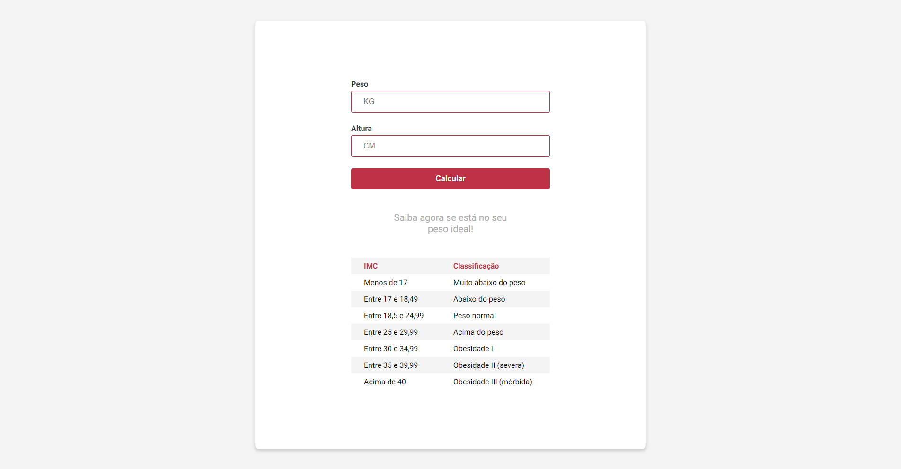
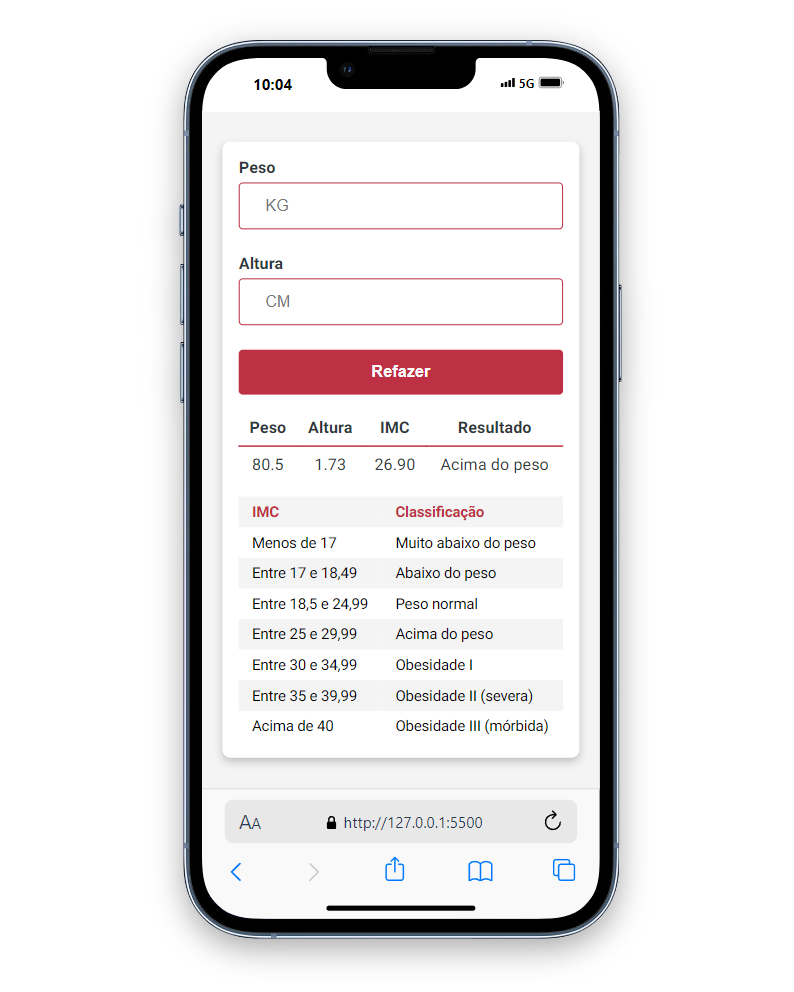

# Calculadora de IMC 

Desenvolvi uma calculadora de IMC em JavaScript, HTML e CSS para praticar minhas habilidades, me desafiar e criar um projeto próprio.

### Screenshot

  
  

### Links

- Figma URL: https://www.figma.com/design/W5optFAm9YJRCurmaErviu/%5BMini-projeto%5D-Calculadora-de-IMC-(Community)?node-id=11-196&t=zu6FtObSwaUtJYgH-0
- Live Site URL: https://ivol1.github.io/Calculadora-IMC/

### Built with

- Semantic HTML5 markup
- CSS custom properties
- Flexbox
- CSS Grid
- Mobile-first workflow
- JavaScript

## Author

- Ivo Luis - @IvoL1
- Linkedin - [@ivo-luis](https://www.linkedin.com/in/ivo-luis/)
